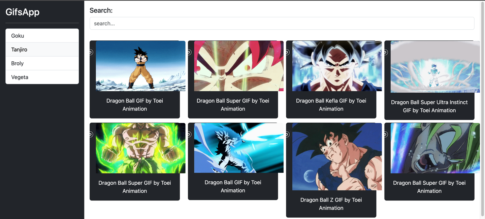

# Gifsapp

This project was generated with [Angular CLI](https://github.com/angular/angular-cli) version 18.0.3. to test new features.

## How to use it

After Downloading the project run `npm install` then Run `ng serve -o` for a dev server. Navigate to `http://localhost:4200/`. The application will automatically reload if you change any of the source files.

## Try it out!

https://sergio8016.github.io/gifsapp/

## Preview

